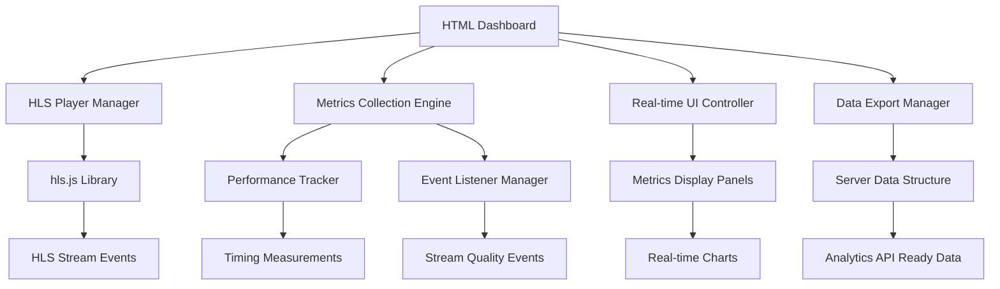

# Design Document

## Overview

The HLS Stream Monitor is a professional single-page web application that provides comprehensive real-time monitoring of HLS streams using precise HLS.js event tracking. The application implements advanced performance metrics collection, detailed analytics based on streaming events, and presents data through a modern, responsive dashboard interface optimized for stream analysis and quality assessment.

The design focuses on accuracy, real-time performance tracking, and professional data presentation suitable for production stream monitoring and analysis workflows.

## Architecture

### High-Level Architecture



### Technology Stack

- **Frontend Framework**: Vanilla JavaScript ES6+ (for precise event handling)
- **HLS Player**: hls.js library (latest version for comprehensive event support)
- **Styling**: Modern CSS3 with CSS Grid, Flexbox, and CSS Custom Properties
- **Charts/Visualization**: Chart.js for real-time performance charts
- **Performance Monitoring**: High-resolution timing APIs (performance.now())
- **Data Structure**: JSON-based metrics collection for server transmission
- **Responsive Design**: CSS Container Queries and Media Queries

## Components and Interfaces

### 1. HLS Player Manager

**Purpose**: Manages HLS.js integration with comprehensive event tracking for precise metrics collection.

**Key Features**:
- HLS.js event listener registration for all monitoring events
- Startup time measurement (play() to first frame)
- Live stream detection and seeking control
- Quality level tracking and bitrate monitoring
- Error event categorization and counting

**Interface**:
```javascript
class HLSPlayerManager {
  constructor(videoElement)
  loadStream(url)
  attachEventListeners()
  measureStartupTime()
  trackQualityChanges()
  getStreamStats()
  destroy()
}
```

### 2. Performance Metrics Tracker

**Purpose**: Collects and calculates all performance metrics based on HLS.js events and timing measurements.

**Key Features**:
- Startup time calculation (play() → first frame)
- Rebuffering tracking (count, duration, ratio)
- Playback time measurement (excluding pauses/buffers)
- Frame drop statistics and ratios
- FPS monitoring (current, min, max)
- Segment loading performance metrics
- Playlist reload timing

**Interface**:
```javascript
class PerformanceTracker {
  constructor()
  
  // Startup metrics
  startStartupMeasurement()
  recordFirstFrame()
  getStartupTime()
  
  // Rebuffering metrics
  onBufferStall()
  onBufferResume()
  getRebufferMetrics()
  
  // Playback tracking
  startPlaybackTimer()
  pausePlaybackTimer()
  getTotalPlaybackTime()
  
  // Frame metrics
  updateFrameStats(droppedFrames, totalFrames)
  getFrameMetrics()
  
  // FPS tracking
  updateFPS(currentFPS)
  getFPSMetrics()
  
  // Segment metrics
  onSegmentLoaded(loadTime, duration)
  getSegmentMetrics()
  
  // Playlist metrics
  onPlaylistReload(reloadTime)
  getPlaylistMetrics()
  
  // Data and error tracking
  updateDataLoaded(bytes)
  recordError()
  getOverallMetrics()
}
```

### 3. Bitrate and Quality Monitor

**Purpose**: Tracks bitrate changes, quality adaptations, and bandwidth estimations.

**Key Features**:
- Current bitrate monitoring
- Average bitrate calculation over session
- Bandwidth estimation tracking
- Quality level change detection
- Adaptive bitrate behavior analysis

**Interface**:
```javascript
class BitrateMonitor {
  constructor()
  onQualityChange(newLevel, bitrate)
  updateBandwidthEstimate(bandwidth)
  getCurrentBitrate()
  getAverageBitrate()
  getCurrentBandwidth()
  getBitrateHistory()
}
```

### 4. Metrics Data Manager

**Purpose**: Organizes all collected metrics into structured data for display and server transmission.

**Key Features**:
- Real-time metrics aggregation
- Data structure organization for server APIs
- JSON serialization for transmission
- Metrics validation and formatting
- Historical data management

**Interface**:
```javascript
class MetricsDataManager {
  constructor()
  updateMetrics(category, data)
  getMetricsSnapshot()
  getServerReadyData()
  exportToJSON()
  resetMetrics()
  
  // Structured data getters
  getStartupMetrics()
  getRebufferMetrics()
  getPlaybackMetrics()
  getFrameMetrics()
  getBitrateMetrics()
  getSegmentMetrics()
  getErrorMetrics()
}
```

### 5. Professional Dashboard UI

**Purpose**: Provides an enhanced user interface with organized metric panels and real-time visualization.

**Key Features**:
- Organized metric panels with clear categorization
- Real-time chart updates for performance trends
- Professional styling with metric units and labels
- Responsive design for different screen sizes
- Visual indicators for metric thresholds

**Interface**:
```javascript
class ProfessionalDashboard {
  constructor()
  initializeLayout()
  createMetricPanels()
  
  // Panel updates
  updateStartupPanel(metrics)
  updateRebufferPanel(metrics)
  updatePlaybackPanel(metrics)
  updateFramePanel(metrics)
  updateBitratePanel(metrics)
  updateSegmentPanel(metrics)
  updateErrorPanel(metrics)
  
  // Chart management
  initializeCharts()
  updateCharts(data)
  
  // UI utilities
  formatMetricValue(value, unit)
  showMetricAlert(metric, threshold)
  exportMetricsView()
}
```

## Data Models

### Professional Metrics Data Structure
```javascript
{
  // Startup Performance
  startup: {
    startup_time: number, // milliseconds from play() to first frame
    timestamp: number
  },
  
  // Rebuffering Metrics
  rebuffering: {
    rebuffer_count: number,
    rebuffer_duration: number, // total seconds
    rebuffer_ratio: number, // percentage (rebuffer_duration / watch_time * 100)
    last_rebuffer_time: number
  },
  
  // Playback Tracking
  playback: {
    watch_time: number, // total session time
    playback_ratio: number // percentage of actual playback vs total time
  },
  
  // Frame Performance
  frames: {
    dropped_frames: number,
    total_frames: number,
    dropped_frame_ratio: number, // percentage
    last_update: number
  },
  
  // FPS Metrics
  fps: {
    current_fps: number,
    min_fps: number,
    max_fps: number,
    avg_fps: number
  },
  
  // Bitrate and Quality
  bitrate: {
    current_bitrate: number, // kbps
    avg_bitrate_played: number, // kbps
    current_bandwidth: number, // kbps
    bitrate_history: Array<{timestamp: number, bitrate: number}>
  },
  
  // Segment Performance
  segments: {
    max_segment_duration: number, // seconds
    min_segment_duration: number, // seconds
    avg_segment_load_time: number, // milliseconds
    min_segment_loadtime: number, // milliseconds
    max_segment_loadtime: number, // milliseconds
    total_segment_loaded: number,
    segment_load_history: Array<{duration: number, loadTime: number}>
  },
  
  // Playlist Performance
  playlist: {
    avg_playlist_reload_time: number, // milliseconds
    min_playlist_reload_time: number, // milliseconds
    max_playlist_reload_time: number, // milliseconds
    reload_count: number,
    reload_history: Array<{timestamp: number, reloadTime: number}>
  },
  
  // Error and Data Tracking
  errors: {
    error_count: number,
    total_events: number,
    error_percentage: number,
    error_types: Object<string, number>,
    last_error: {type: string, timestamp: number, message: string}
  },
  
  // Data Consumption
  data: {
    total_data_loaded: number, // GB
    data_rate: number, // MB/s
    data_efficiency: number // MB per minute of playback
  },
  
  // Session Information
  session: {
    start_time: number,
    current_time: number,
    session_duration: number, // seconds
    stream_url: string,
    is_live: boolean
  }
}
```

### Server Transmission Data Model
```javascript
{
  session_id: string,
  timestamp: number,
  stream_url: string,
  metrics: {
    // All metrics from above structure
    startup_time: number,
    rebuffer_count: number,
    rebuffer_duration: number,
    rebuffer_ratio: number,

    dropped_frames: number,
    total_frames: number,
    dropped_frame_ratio: number,
    current_fps: number,
    min_fps: number,
    max_fps: number,
    current_bitrate: number,
    avg_bitrate_played: number,
    current_bandwidth: number,
    max_segment_duration: number,
    min_segment_duration: number,
    avg_segment_load_time: number,
    min_segment_loadtime: number,
    max_segment_loadtime: number,
    avg_playlist_reload_time: number,
    min_playlist_reload_time: number,
    max_playlist_reload_time: number,
    error_percentage: number,
    total_segment_loaded: number,
    total_data_loaded: number
  },
  user_agent: string,
  browser_info: Object,
  network_info: Object
}
```

## User Interface Design

### Enhanced Layout Structure

The interface uses a professional grid-based layout optimized for comprehensive metrics display:

1. **Header Section**
   - Application title with professional branding
   - Stream URL input with real-time validation
   - Session controls and export functionality
   - Live status indicator with enhanced animation

2. **Video Player Section**
   - Responsive video player with HLS.js integration
   - Enhanced live indicator with session time
   - Quality selector with bitrate information
   - Playback controls with buffer visualization

3. **Professional Metrics Dashboard**
   - **Startup Performance Panel**: startup_time with visual indicator
   - **Rebuffering Analytics Panel**: count, duration, ratio with trend charts
   - **Playback Quality Panel**: watch_time, frame metrics, FPS stats
   - **Bitrate Monitoring Panel**: current, average, bandwidth with real-time graphs
   - **Segment Performance Panel**: loading times, durations with min/max/avg
   - **Playlist Performance Panel**: reload times and frequency analysis
   - **Error & Data Panel**: error percentage, total data loaded, efficiency metrics

### Professional Visual Design

- **Color Scheme**: 
  - Dark professional theme (#1a1a1a background)
  - Accent colors: Green (#00ff88) for good metrics, Yellow (#ffaa00) for warnings, Red (#ff4444) for errors
  - Blue (#0088ff) for informational metrics
- **Typography**: 
  - Primary: 'Inter' or 'Roboto' for readability
  - Monospace: 'JetBrains Mono' for numeric values
  - Clear hierarchy with consistent sizing
- **Spacing**: 
  - 8px grid system for consistent spacing
  - Card padding: 24px, margins: 16px
  - Responsive breakpoints: 768px, 1024px, 1440px
- **Animations**: 
  - Smooth value transitions (0.3s ease)
  - Pulsing indicators for active metrics
  - Chart animations for data updates

### Enhanced Metric Display Components

```css
.metric-card {
  background: #2a2a2a;
  border-radius: 12px;
  padding: 24px;
  border: 1px solid #404040;
  transition: all 0.3s ease;
}

.metric-value {
  font-family: 'JetBrains Mono', monospace;
  font-size: 2rem;
  font-weight: 600;
  color: #00ff88;
}

.metric-label {
  font-size: 0.875rem;
  color: #888;
  text-transform: uppercase;
  letter-spacing: 0.5px;
}

.metric-unit {
  font-size: 1rem;
  color: #aaa;
  margin-left: 4px;
}

.live-indicator-enhanced {
  background: linear-gradient(45deg, #ff4444, #ff6666);
  color: white;
  padding: 12px 20px;
  border-radius: 25px;
  font-weight: 700;
  animation: livePulse 2s infinite;
  box-shadow: 0 0 20px rgba(255, 68, 68, 0.3);
}

@keyframes livePulse {
  0% { opacity: 1; transform: scale(1); }
  50% { opacity: 0.8; transform: scale(1.05); }
  100% { opacity: 1; transform: scale(1); }
}
```

## Error Handling

### HLS.js Event-Based Error Handling
- **Network Errors**: Connection timeouts, segment loading failures
- **Media Errors**: Decode errors, format incompatibility
- **MUX Errors**: Manifest parsing issues, invalid playlists
- **Other Errors**: Unknown or unexpected HLS.js errors

### Metrics Collection Error Handling
- **Timing API Unavailability**: Fallback to Date.now() for older browsers
- **Performance Observer Failures**: Graceful degradation for frame metrics
- **Event Listener Failures**: Robust error catching around HLS.js events
- **Data Calculation Errors**: Safe division and null checks for ratios

### Recovery Strategies
- **Automatic Retry**: Stream loading with exponential backoff
- **Graceful Degradation**: Continue monitoring available metrics when some fail
- **Error Categorization**: Classify errors for better analysis
- **Fallback Measurements**: Alternative timing methods when high-precision APIs fail
- **Data Validation**: Ensure metric calculations don't produce invalid values

## Testing Strategy

### Metrics Accuracy Testing
- **Startup Time Validation**: Compare with manual timing measurements
- **Rebuffering Detection**: Test with simulated network interruptions
- **Frame Drop Accuracy**: Validate against browser developer tools
- **Bitrate Tracking**: Verify against HLS.js internal metrics
- **Segment Timing**: Cross-reference with network tab measurements

### HLS.js Event Integration Testing
- **Event Listener Coverage**: Ensure all required events are captured
- **Event Timing Accuracy**: Validate event sequence and timing
- **Error Event Handling**: Test various error scenarios
- **Quality Change Events**: Test adaptive bitrate scenarios
- **Live Stream Events**: Validate live-specific event handling

### Real-time Performance Testing
- **UI Update Performance**: Ensure smooth updates at high frequency
- **Memory Usage**: Monitor for memory leaks during long sessions
- **CPU Impact**: Measure performance overhead of metrics collection
- **Data Structure Efficiency**: Test large dataset handling

### Cross-browser Compatibility Testing
- **Modern Browsers**: Chrome 90+, Firefox 88+, Safari 14+, Edge 90+
- **Mobile Browsers**: iOS Safari, Chrome Mobile, Samsung Internet
- **API Availability**: Test fallbacks for missing performance APIs
- **HLS.js Compatibility**: Ensure consistent behavior across browsers

## Performance Considerations

### High-Precision Metrics Collection
- **Performance.now()**: Use high-resolution timing for accurate measurements
- **RequestAnimationFrame**: Optimize FPS calculations and UI updates
- **Efficient Event Handling**: Minimize overhead from HLS.js event listeners
- **Debounced Updates**: Batch UI updates to prevent excessive DOM manipulation

### Memory Management
- **Circular Buffers**: Limit historical data storage to prevent memory growth
- **Event Listener Cleanup**: Proper removal of listeners on component destruction
- **Chart Data Pruning**: Maintain reasonable chart data limits
- **Garbage Collection**: Minimize object creation in hot paths

### Real-time Update Optimization
- **Selective Updates**: Only update changed metrics to reduce DOM operations
- **Animation Frame Scheduling**: Coordinate updates with browser refresh rate
- **Data Aggregation**: Batch multiple metric updates into single UI refresh
- **Chart Performance**: Use efficient chart update methods for real-time data

### Scalability and Efficiency
- **Minimal Dependencies**: Keep external library usage focused and lightweight
- **Modular Architecture**: Enable selective feature loading
- **CPU Usage Monitoring**: Ensure metrics collection doesn't impact playback
- **Network Efficiency**: Optimize data structure for server transmission