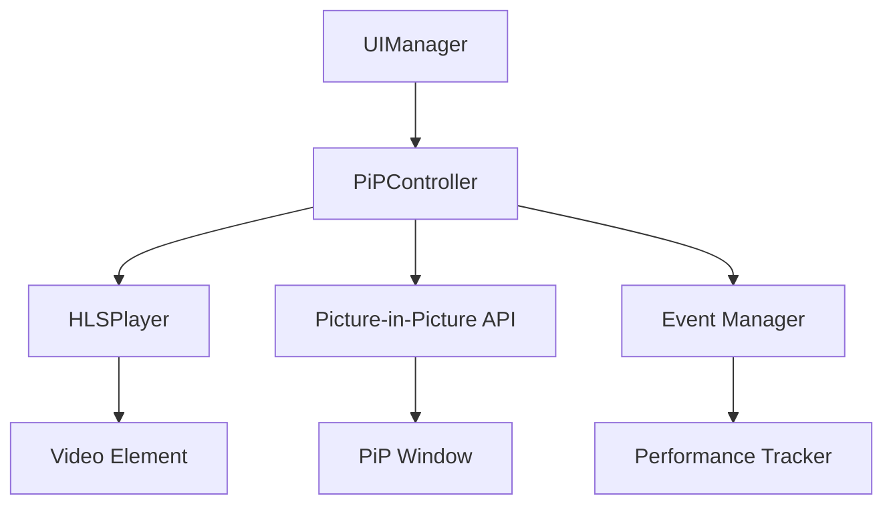

# Tài liệu Thiết kế - Chức năng Hình trong Hình

## Tổng quan

Chức năng Picture-in-Picture (PiP) sẽ được tích hợp vào hệ thống HLS streaming hiện tại, cho phép người dùng xem video trong một cửa sổ nổi nhỏ trong khi làm việc với các ứng dụng khác. Thiết kế này tận dụng Picture-in-Picture Web API và tích hợp mượt mà với kiến trúc HLSPlayer và UIManager hiện có.

## Kiến trúc

### Kiến trúc tổng thể



### Luồng dữ liệu chính

1. **Kích hoạt PiP**: UIManager → PiPController → Picture-in-Picture API
2. **Điều khiển video**: PiP Window → PiPController → HLSPlayer
3. **Theo dõi metrics**: PiPController → Performance Tracker
4. **Xử lý lỗi**: Picture-in-Picture API → PiPController → UIManager

## Thành phần và Giao diện

### 1. PiPController (Thành phần chính mới)

```javascript
class PiPController {
    constructor(videoElement, hlsPlayer, uiManager, performanceTracker)
    
    // Phương thức chính
    async enterPictureInPicture()
    async exitPictureInPicture()
    isPiPSupported()
    isPiPActive()
    
    // Xử lý sự kiện
    handlePiPEnter()
    handlePiPLeave()
    handlePiPResize()
    
    // Tích hợp với hệ thống hiện tại
    attachToHLSPlayer(hlsPlayer)
    attachToUIManager(uiManager)
    attachToPerformanceTracker(tracker)
}
```

### 2. Mở rộng UIManager

Thêm các phương thức mới vào UIManager hiện tại:

```javascript
// Thêm vào UIManager
initializePiPControls()
updatePiPButton()
togglePictureInPicture()
handlePiPKeyboardShortcut() // Phím tắt 'P'
```

### 3. Mở rộng HLSPlayer

Thêm hỗ trợ PiP vào HLSPlayer:

```javascript
// Thêm vào HLSPlayer
setPiPController(pipController)
onPiPStateChange(isActive)
maintainStreamQuality() // Đảm bảo chất lượng trong PiP
```

### 4. Giao diện người dùng

#### Nút PiP trong Controls
- Vị trí: Bên cạnh nút fullscreen trong video controls
- Icon: `fas fa-external-link-alt` (khi không active), `fas fa-compress-arrows-alt` (khi active)
- Tooltip: "Picture-in-Picture" / "Exit Picture-in-Picture"

#### Cửa sổ PiP
- Kích thước mặc định: 320x180px (tỷ lệ 16:9)
- Vị trí mặc định: Góc dưới bên phải màn hình
- Controls tối thiểu: Play/Pause, Close

## Mô hình Dữ liệu

### PiP State Management

```javascript
const pipState = {
    isSupported: boolean,
    isActive: boolean,
    windowSize: { width: number, height: number },
    position: { x: number, y: number },
    videoState: {
        currentTime: number,
        paused: boolean,
        volume: number,
        muted: boolean
    },
    metrics: {
        activationTime: number,
        totalPiPTime: number,
        interactionCount: number
    }
}
```

### Event Types

```javascript
const PiPEvents = {
    ENTER_PIP: 'enterPictureInPicture',
    LEAVE_PIP: 'leavePictureInPicture',
    PIP_RESIZE: 'pictureInPictureResize',
    PIP_ERROR: 'pictureInPictureError'
}
```

## Xử lý Lỗi

### Hierarchy xử lý lỗi

1. **Browser không hỗ trợ PiP**
   - Ẩn nút PiP
   - Hiển thị tooltip thông báo không hỗ trợ
   - Log warning cho developer

2. **Lỗi khi kích hoạt PiP**
   - Hiển thị thông báo lỗi cho người dùng
   - Fallback về trình phát thường
   - Log chi tiết lỗi

3. **Lỗi trong quá trình PiP**
   - Tự động thoát PiP
   - Khôi phục video trong trình phát chính
   - Thông báo cho người dùng

4. **Xung đột với các PiP khác**
   - Kiểm tra document.pictureInPictureElement
   - Thông báo người dùng về xung đột
   - Đề xuất đóng PiP hiện tại

### Error Recovery Strategy

```javascript
const errorRecoveryStrategies = {
    'NotSupportedError': () => this.hidePiPButton(),
    'InvalidStateError': () => this.resetVideoState(),
    'NotAllowedError': () => this.showPermissionMessage(),
    'AbortError': () => this.gracefulFallback()
}
```

## Chiến lược Kiểm thử

### 1. Unit Tests

**PiPController Tests:**
- `should detect PiP support correctly`
- `should enter PiP mode successfully`
- `should exit PiP mode successfully`
- `should handle unsupported browsers gracefully`
- `should maintain video state during transitions`

**UIManager Integration Tests:**
- `should show/hide PiP button based on support`
- `should update button state correctly`
- `should handle keyboard shortcuts`

### 2. Integration Tests

**HLSPlayer Integration:**
- `should maintain stream quality in PiP mode`
- `should continue performance tracking in PiP`
- `should handle stream errors during PiP`

**Cross-browser Compatibility:**
- Chrome/Edge (full support)
- Firefox (limited support)
- Safari (native support)
- Mobile browsers (limited/no support)

### 3. User Experience Tests

**Accessibility:**
- Screen reader compatibility
- Keyboard navigation
- Focus management
- ARIA labels và announcements

**Performance:**
- Memory usage trong PiP mode
- CPU usage comparison
- Battery impact trên mobile devices

### 4. Error Handling Tests

- Network interruption during PiP
- Multiple PiP attempts
- Browser permission denial
- Video element removal during PiP

## Tích hợp với Hệ thống Hiện tại

### Performance Tracking Integration

```javascript
// Mở rộng PerformanceTracker để theo dõi PiP metrics
const pipMetrics = {
    pip_activations: 0,
    pip_total_time: 0,
    pip_average_session: 0,
    pip_exit_reasons: {
        user_action: 0,
        error: 0,
        page_navigation: 0
    }
}
```

### Memory Management

- Sử dụng MemoryManager hiện tại cho event listeners
- Cleanup tự động khi thoát PiP
- Garbage collection cho unused resources

### Accessibility Integration

- Tích hợp với live region announcements
- Keyboard shortcuts (phím 'P' cho toggle PiP)
- Screen reader support cho PiP state changes
- Focus management khi enter/exit PiP

## Cấu hình và Tùy chỉnh

### Default Configuration

```javascript
const pipConfig = {
    defaultSize: { width: 320, height: 180 },
    minSize: { width: 240, height: 135 },
    maxSize: { width: 640, height: 360 },
    position: 'bottom-right',
    autoHide: true,
    keyboardShortcut: 'KeyP',
    showControls: true,
    enableResize: true
}
```

### Customization Options

- Kích thước cửa sổ PiP
- Vị trí mặc định
- Keyboard shortcuts
- Auto-hide behavior
- Control visibility

## Bảo mật và Quyền riêng tư

### Permission Handling

- Kiểm tra user gesture requirement
- Xử lý permission denial gracefully
- Thông báo rõ ràng về requirements

### Privacy Considerations

- Không thu thập thêm dữ liệu cá nhân
- PiP metrics chỉ cho performance optimization
- Tuân thủ existing privacy policy

## Hiệu suất và Tối ưu hóa

### Performance Optimizations

1. **Lazy Loading**: Chỉ load PiP controller khi cần
2. **Event Debouncing**: Throttle resize events
3. **Memory Cleanup**: Automatic cleanup on exit
4. **Resource Sharing**: Reuse existing video element

### Monitoring Metrics

- PiP activation success rate
- Average PiP session duration
- Error rates by browser
- User interaction patterns

## Roadmap và Mở rộng Tương lai

### Phase 1 (Current)
- Basic PiP functionality
- Browser compatibility
- Error handling

### Phase 2 (Future)
- Custom PiP controls
- Multi-video PiP support
- Advanced positioning options

### Phase 3 (Advanced)
- Mobile PiP support
- Cross-tab PiP synchronization
- Advanced analytics integration