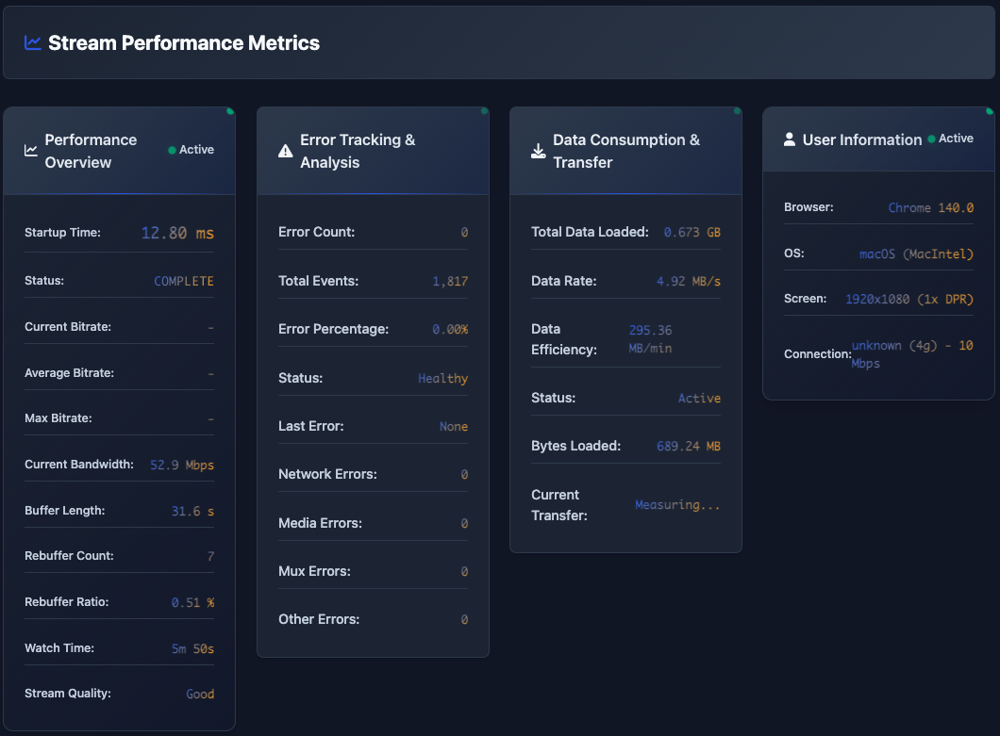
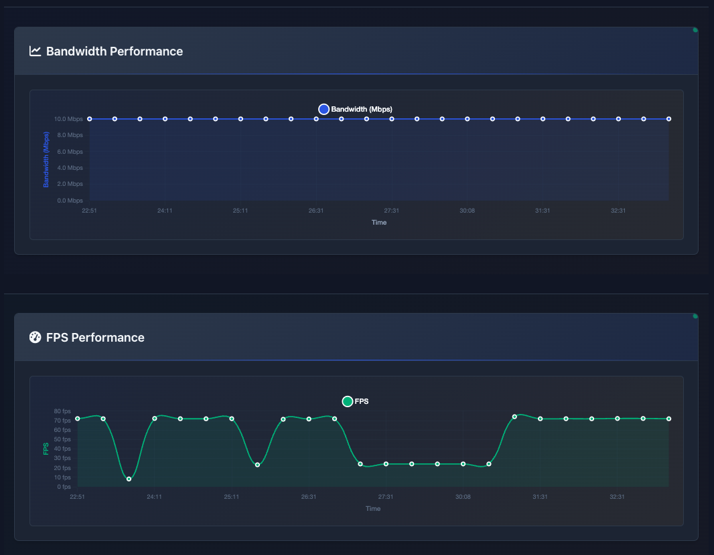

# 🎥 HLS Stream Monitor

<div align="center">


**Professional tool for monitoring and load testing HLS streams**

[](https://opensource.org/licenses/MIT)
[](https://developer.mozilla.org/en-US/docs/Web/JavaScript)
[](https://github.com/video-dev/hls.js/)
[](https://web.dev/progressive-web-apps/)

</div>

## 📋 Overview

HLS Stream Monitor is a professional web application designed for monitoring, analyzing, and load testing HLS (HTTP Live Streaming) streams. This tool provides a real-time dashboard with detailed metrics about performance, stream quality, and user experience.

### ✨ Key Features

- 🎬 **Integrated HLS Player** - Supports HLS.js and native HLS playback
- 📊 **Real-time Monitoring** - Live performance metrics tracking
- 🚀 **Performance Tracking** - Measures startup time, rebuffering, FPS
- 📈 **Bandwidth Analysis** - Analyzes bandwidth and bitrate
- 🔍 **Error Tracking** - Detailed error monitoring and analysis
- 💾 **Data Consumption** - Monitors data usage and consumption
- 📱 **Responsive Design** - Optimized for all devices
- ⌨️ **Keyboard Shortcuts** - Quick control with hotkeys
- 🌐 **PWA Support** - Install as native application
- 📤 **Export Metrics** - Export JSON/CSV data for analysis

## 🖼️ Screenshots

### Main Dashboard


### Performance Metrics




## 🛠️ System Requirements

### Supported Browsers
- ✅ Chrome 80+
- ✅ Firefox 75+
- ✅ Safari 13+
- ✅ Edge 80+

### Required Features
- JavaScript ES6+ support
- WebRTC API (for network metrics)
- Performance API
- Service Worker support (optional)

## 🚀 Installation & Usage

### Quick Setup

1. **Clone repository**
```bash
git clone https://github.com/your-username/hls-stream-monitor.git
cd hls-stream-monitor
```

2. **Run local server**
```bash
# Using Python
python -m http.server 8000

# Or Node.js
npx serve .

# Or PHP
php -S localhost:8000
```

3. **Access application**
```
http://localhost:8000
```

### Basic Usage

1. **Enter HLS stream URL**
   - Paste .m3u8 URL into input field
   - Example: `https://example.com/stream/playlist.m3u8`

2. **Load stream**
   - Click "Load Stream" button or press `R`
   - Wait for stream to load and start playing

3. **Monitor metrics**
   - View real-time dashboard
   - Track performance charts
   - Check error logs

4. **Export data**
   - Click "Export Metrics" to download JSON/CSV
   - Use for offline analysis

## 📁 Project Structure

```
hls-stream-monitor/
├── 📄 index.html              # Main interface
├── 📄 app.js                  # Application entry point
├── 📄 styles.css              # Main styling
├── 📄 sw.js                   # Service Worker
├── 🎨 professional-enhancements.css
├── 📁 js/
│   ├── 📁 core/               # Core modules
│   │   ├── 📄 PerformanceTracker.js
│   │   ├── 📄 ErrorTracker.js
│   │   ├── 📄 DataConsumptionTracker.js
│   │   ├── 📄 MemoryManager.js
│   │   ├── 📄 MetricsDataManager.js
│   │   └── 📄 ComponentIntegrator.js
│   ├── 📁 ui/                 # UI components
│   │   ├── 📄 UIManager.js
│   │   └── 📄 ProfessionalDashboard.js
│   └── 📁 player/             # Player components
│       └── 📄 HLSPlayer.js
└── 🖼️ assets/                # Images and icons
    ├── favicon.webp
    ├── header_logo.svg
    └── logo-white.svg
```

## 🔧 API Documentation

### PerformanceTracker

```javascript
// Initialize performance tracking
const tracker = new PerformanceTracker();

// Start measuring startup time
tracker.startStartupMeasurement();

// Record first frame
tracker.recordFirstFrame();

// Get current metrics
const metrics = tracker.getMetrics();
```

### ErrorTracker

```javascript
// Initialize error tracking
const errorTracker = new ErrorTracker();

// Record error
errorTracker.recordError('network', 'Connection failed', 'Detailed description');

// Get error statistics
const stats = errorTracker.getErrorStats();
```

### DataConsumptionTracker

```javascript
// Initialize data tracking
const dataTracker = new DataConsumptionTracker();

// Track fragment loading
dataTracker.trackFragmentLoad(fragmentSize, loadTime);

// Get data metrics
const dataMetrics = dataTracker.getDataMetrics();
```

## ⌨️ Keyboard Shortcuts

| Key | Function |
|-----|----------|
| `Space` | Play/Pause video |
| `F` | Toggle fullscreen |
| `M` | Mute/Unmute |
| `↑` | Volume up |
| `↓` | Volume down |
| `R` | Reload stream |
| `Esc` | Exit fullscreen |
| `?` | Show/hide keyboard help |

## 📊 Tracked Metrics

### Performance Metrics
- **Startup Time** - Time from play to first frame
- **Rebuffering** - Count and duration of rebuffers
- **FPS** - Real-time frames per second
- **Dropped Frames** - Number of dropped frames

### Network Metrics  
- **Bandwidth** - Current and historical bandwidth
- **Bitrate** - Stream bitrate and adaptive changes
- **Connection Type** - Network connection type
- **RTT** - Round-trip time

### Data Consumption
- **Total Downloaded** - Total data downloaded
- **Download Rate** - Download speed
- **Fragment Analysis** - Per-segment analysis

## 🔧 Troubleshooting

### Stream won't load
```
✅ Check .m3u8 URL format is correct
✅ Verify CORS headers from server
✅ Test stream in VLC player
✅ Check browser console for errors
```

### Metrics not displaying
```
✅ Ensure JavaScript is enabled
✅ Check Performance API support
✅ Verify WebRTC API availability
✅ Test in different browser
```

### Performance issues
```
✅ Close other tabs
✅ Disable browser extensions
✅ Check system resources
✅ Try lower quality stream
```

## 🤝 Contributing

We welcome all contributions! Please:

1. Fork the repository
2. Create feature branch (`git checkout -b feature/AmazingFeature`)
3. Commit your changes (`git commit -m 'Add some AmazingFeature'`)
4. Push to branch (`git push origin feature/AmazingFeature`)
5. Open a Pull Request

### Development Setup

```bash
# Clone and setup
git clone https://github.com/your-username/hls-stream-monitor.git
cd hls-stream-monitor

# Run development server
npm run dev

# Or use live-server
npx live-server --port=8000
```

## 📝 Changelog

### v1.0.0 (Latest)
- ✨ Initial release
- 🎬 HLS player with full metrics
- 📊 Real-time dashboard
- 📤 Export functionality
- ⌨️ Keyboard shortcuts
- 🌐 PWA support

## 📄 License

This project is distributed under the MIT License. See `LICENSE` file for more details.

## 👨‍💻 Authors

**Ott-clouds Team**
- Website: [https://ott-clouds.com](https://ott-clouds.com)
- Email: support@ott-clouds.com

## 🙏 Acknowledgments

- [HLS.js](https://github.com/video-dev/hls.js/) - HLS playback library
- [Chart.js](https://www.chartjs.org/) - Data visualization
- [Font Awesome](https://fontawesome.com/) - Icons
- [MDN Web Docs](https://developer.mozilla.org/) - Web APIs documentation

---

<div align="center">

**⭐ If this project is helpful, please give us a star! ⭐**

Made with ❤️ by Ott-clouds Team

</div>